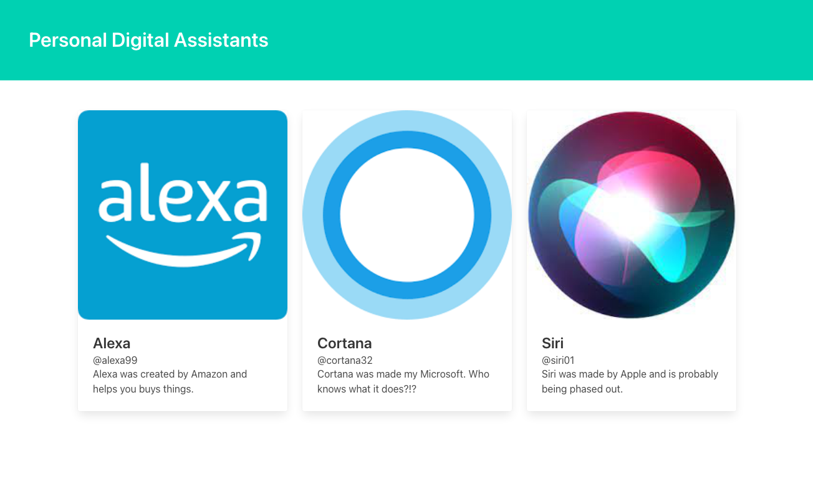

# Personal-Digital-Assistants
A small static project using React and styling with Bulma.

## Description
- Users can view 3 personal digital assistants.
- Display of the app image, title, handle, and short description".

## Purpose
This is a small personal project to continue learning React.

## License

